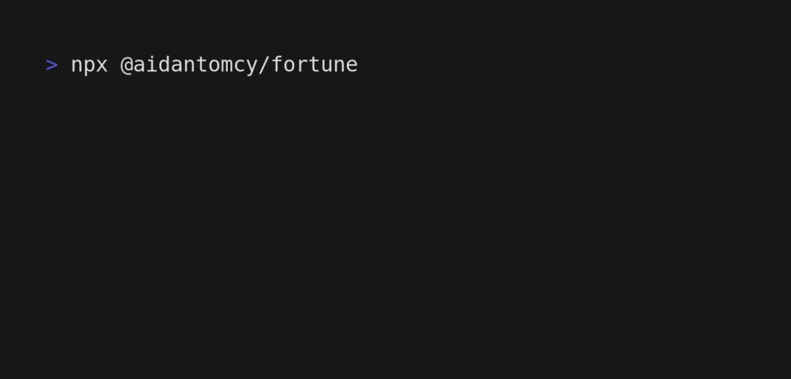

# fortune

This is a cli tool made in JavaScript, similar to the fortune package for Linux.
This project uses the [Zen Quotes API](https://zenquotes.io/api).



## Usage
To use this, run the following command (Requires NPM version 5.2 or higher):
```
npx @aidantomcy/fortune
```
Or, if you are on a version of NPM below 5.2, run the following commands:
```
npm i -g @aidantomcy/fortune
fortune
```
